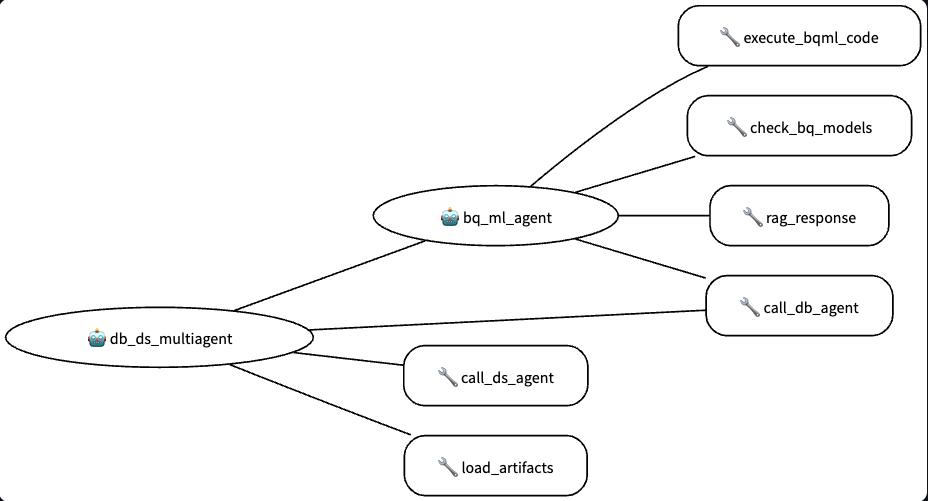

# Data Analyst Agent - Advanced Multi-Agent System

**🏗️ Built on Google ADK Samples**

This data-analyst agent is built upon and customized from the original [Google ADK (Agent Development Kit) Samples repository](https://github.com/google/adk-samples), specifically the `data-science` agent. We extend our heartfelt gratitude to the Google AI Platform team and all contributors to the original ADK samples repository for providing this excellent foundation.

## 🆕 Latest Updates

**Recent Enhancements (Current Branch: `rag`)**
- ✅ **RAG Integration**: Added sophisticated knowledge retrieval capabilities using existing RAG corpora
- ✅ **Web Search**: Integrated real-time web search functionality for current information and research
- ✅ **Enhanced Multi-Agent Architecture**: Now features 6 specialized sub-agents working in harmony
- ✅ **Production Hardening**: Comprehensive environment management and security improvements
- ✅ **Infrastructure Optimization**: Designed to work with existing Google Cloud resources

## Credits & Acknowledgments

**Original Repository:** [google/adk-samples](https://github.com/google/adk-samples)  
**Original Agent:** `python/agents/data-science`  
**License:** Apache License 2.0  
**Copyright:** 2025 Google LLC  

**Key Contributors:**
- Google AI Platform Team
- ADK Development Team  
- Original data-science agent authors
- All contributors to the adk-samples repository

**Our Customizations:**
- ✅ Configured for existing infrastructure (no new resource creation)
- ✅ Fixed SQL validation issues for production readiness
- ✅ Added comprehensive environment variable management
- ✅ Removed all hardcoded values for security and portability
- ✅ Enhanced deployment procedures and testing workflows
- ✅ **NEW**: Integrated RAG capabilities for domain knowledge retrieval
- ✅ **NEW**: Added web search functionality for real-time information
- ✅ **NEW**: Enhanced multi-agent orchestration system
- ✅ Created detailed setup documentation for real-world usage

---

## Overview

**▶️ Watch the Video Walkthrough:** [How to build a Data Science agent with ADK](https://www.youtube.com/watch?v=efcUXoMX818)

The **Data Analyst Agent** is a sophisticated multi-agent system designed for advanced data analysis, real-time information retrieval, and contextual knowledge enhancement using existing Google Cloud infrastructure. This project demonstrates how multiple specialized agents can work together to handle different aspects of the data pipeline, from data retrieval to advanced analytics, machine learning, web search, and knowledge augmentation.

The system is built to interact with BigQuery, perform complex data manipulations, generate data visualizations, execute machine learning tasks using BigQuery ML (BQML), search the web for current information, and retrieve contextual knowledge from organizational documentation through RAG capabilities.

## Agent Specifications

| Feature | Description |
| --- | --- |
| **Interaction Type:** | Conversational |
| **Complexity:**  | Advanced |
| **Agent Type:**  | Multi-Agent System (6 Specialized Sub-Agents) |
| **Components:**  | Tools, AgentTools, Session Memory, RAG, Web Search |
| **Vertical:**  | Universal (Applicable across all industries) |
| **Infrastructure:**  | Uses Existing Google Cloud Resources |

## 🏗️ System Architecture

### Core Architecture


### Multi-Agent Ecosystem

The system employs a **hierarchical multi-agent architecture** with a root orchestrator managing 6 specialized sub-agents:


## 🎯 Key Features

### **Multi-Agent Intelligence**
- **Root Agent**: Orchestrates workflow and manages multi-agent interactions
- **Database Agent**: Natural Language to SQL (NL2SQL) for BigQuery operations
- **Analytics Agent**: Natural Language to Python (NL2Py) for data science workflows
- **BQML Agent**: BigQuery ML model training, evaluation, and prediction
- **RAG Agent**: 🆕 Contextual knowledge retrieval from organizational documentation
- **Search Agent**: 🆕 Real-time web search for current information and research

### **Advanced Capabilities**
- **🔍 Semantic Knowledge Retrieval**: Leverages pre-configured RAG corpora for domain expertise
- **🌐 Real-Time Information Access**: Web search integration for current events and research
- **📊 Comprehensive Data Pipeline**: End-to-end data analysis from query to visualization
- **🤖 Machine Learning Integration**: Full BQML lifecycle management
- **💻 Code Execution**: Python code interpreter for complex analysis
- **🎨 Visualization Generation**: Advanced plotting and data visualization capabilities
- **🔒 Production Security**: Environment-based configuration management

### **Enterprise-Ready Features**
- **Infrastructure Agnostic**: Works with existing Google Cloud resources
- **Security Hardened**: No hardcoded credentials or resource IDs
- **Scalable Architecture**: Modular sub-agent design for extensibility
- **Comprehensive Testing**: Built-in testing and validation frameworks
- **Deployment Automation**: Streamlined deployment to Vertex AI Agent Engine

## 🛠️ Specialized Sub-Agents

| Agent | Purpose | Key Capabilities |
|-------|---------|------------------|
| **Database Agent** | BigQuery Operations | NL2SQL translation, schema exploration, data retrieval |
| **Analytics Agent** | Data Science | NL2Py analysis, statistical computing, data manipulation |
| **BQML Agent** | Machine Learning | Model training, evaluation, hyperparameter tuning, predictions |
| **RAG Agent** | Knowledge Retrieval | Domain expertise, documentation search, contextual enhancement |
| **Search Agent** | Web Intelligence | Real-time information, research, fact verification |
| **Code Interpreter** | Execution Engine | Python code execution, visualization generation |

## Prerequisites

### System Requirements
- **Python**: 3.12+
- **Poetry**: For dependency management
- **Google Cloud Account**: With BigQuery enabled
- **Region**: `us-central1` (tested and validated)

⚠️ **Important Location Note**: This agent is currently tested and validated for **us-central1** region only. While it may work in other Google Cloud regions, compatibility and functionality in other locations have not been verified.

### Required Google Cloud Infrastructure
- ✅ BigQuery project and dataset with data tables
- ✅ RAG corpora for business knowledge and BQML documentation
- ✅ Code Interpreter extension in Vertex AI
- ✅ Cloud Storage bucket for staging
- ✅ Proper IAM permissions configured

## 🚀 Quick Start Guide

### 1. Repository Setup

```bash
# Navigate to the agent directory
cd adk-samples/python/agents/data-analyst

# Install dependencies
poetry install

# Activate environment
poetry shell
```

### 2. Environment Configuration

Create your `.env` file with existing infrastructure details:

```bash
# Core Configuration - REQUIRED
GOOGLE_GENAI_USE_VERTEXAI=1  # Use Vertex AI instead of Google AI Studio
GOOGLE_CLOUD_PROJECT=your-existing-project-id
BQ_PROJECT_ID=your-existing-project-id
BQ_DATASET_ID=your-existing-dataset-id

# Model Configuration (Gemini 2.5 Flash recommended)
ROOT_AGENT_MODEL=gemini-2.5-flash
DATA_ANALYST_AGENT_MODEL=gemini-2.5-flash
BIGQUERY_AGENT_MODEL=gemini-2.5-flash
ANALYTICS_AGENT_MODEL=gemini-2.5-flash
BQML_AGENT_MODEL=gemini-2.5-flash

# RAG Configuration - Use your existing corpora
RAG_CORPUS=projects/PROJECT_NUMBER/locations/us-central1/ragCorpora/YOUR_RAG_CORPUS_ID
BQML_RAG_CORPUS_NAME=projects/PROJECT_NUMBER/locations/us-central1/ragCorpora/YOUR_BQML_RAG_CORPUS_ID

# Infrastructure Configuration
GOOGLE_CLOUD_LOCATION=us-central1
GOOGLE_CLOUD_STORAGE_BUCKET=your-existing-storage-bucket
CODE_INTERPRETER_EXTENSION_NAME=projects/PROJECT_NUMBER/locations/us-central1/extensions/YOUR_EXTENSION_ID

# SQL Generation Method
NL2SQL_METHOD=BASELINE
BASELINE_NL2SQL_MODEL=gemini-2.5-flash
CHASE_NL2SQL_MODEL=gemini-2.5-flash
```

### 3. Local Testing

```bash
# Test the agent locally
poetry run adk run data_analyst

# Test with web interface
poetry run adk web
```

### 4. Build for Deployment

```bash
# Build the wheel package
poetry build --format=wheel --output=deployment
```

### 5. Deploy to Vertex AI

```bash
# Deploy to Agent Engine
cd deployment/
poetry run python deploy.py --create
```

## 🔧 Configuration Deep Dive

### Critical Configuration Fix

**Issue**: Missing Vertex AI Configuration  
**Error**: `Missing key inputs argument! To use the Google AI API, provide ('api_key') arguments...`  
**Solution**: Add `GOOGLE_GENAI_USE_VERTEXAI=1` to your `.env` file

### SQL Validation Fix

**Issue**: False positive DML/DDL validation errors  
**Problem**: Regex pattern was too broad: `r"(?i)(update|delete|drop|insert|create|alter|truncate|merge)"`  
**Solution**: Fixed with word boundaries: `r"(?i)\b(update|delete|drop|insert|create|alter|truncate|merge)\b"`

## 🎯 Usage Examples

### Database Operations
```
User: What data do you have access to?
Agent: I have access to your BigQuery dataset containing multiple tables with business data, partitioned by date for optimal performance.

User: Show me total sales by country in the last 30 days
Agent: [Executes SQL query and returns results with visualization]
```

### Enhanced Knowledge Retrieval
```
User: What are BQML best practices for time series forecasting?
Agent: Based on our BQML documentation corpus, here are the key recommendations:
1. Data Preparation: Ensure consistent intervals
2. Model Selection: ARIMA_PLUS for most scenarios
3. Feature Engineering: Use holiday effects
[Provides detailed guidance from RAG corpus]
```

### Real-Time Research
```
User: What are the latest trends in machine learning for retail analytics?
Agent: [Searches web for current ML trends in retail]
Based on recent research and industry reports, here are the emerging trends:
1. Real-time personalization using transformer models
2. Computer vision for inventory management
[Provides current, sourced information]
```

### Multi-Modal Analysis
```
User: Analyze customer segments and provide business context
Agent: I'll combine your data analysis with business intelligence:
1. [Queries database for customer segmentation]
2. [Retrieves business context from RAG corpus]
3. [Searches for industry benchmarks]
4. [Provides comprehensive analysis with actionable insights]
```

## 🏢 Production Deployment

### Prerequisites for Deployment

Set up required permissions:

```bash
export RE_SA="service-${GOOGLE_CLOUD_PROJECT_NUMBER}@gcp-sa-aiplatform-re.iam.gserviceaccount.com"

# Grant BigQuery permissions
gcloud projects add-iam-policy-binding ${GOOGLE_CLOUD_PROJECT} \
    --member="serviceAccount:${RE_SA}" \
    --role="roles/bigquery.user"

gcloud projects add-iam-policy-binding ${GOOGLE_CLOUD_PROJECT} \
    --member="serviceAccount:${RE_SA}" \
    --role="roles/bigquery.dataViewer"

# Grant Vertex AI permissions
gcloud projects add-iam-policy-binding ${GOOGLE_CLOUD_PROJECT} \
    --member="serviceAccount:${RE_SA}" \
    --role="roles/aiplatform.user"
```

### Deployment Commands

```bash
# Create new agent
cd deployment/
poetry run python deploy.py --create

# Delete existing agent
poetry run python deploy.py --delete --resource_id=RESOURCE_ID
```

### Testing Deployed Agent

```bash
# Test with deployment script
export RESOURCE_ID=your-resource-id
export USER_ID=test_user
poetry run python test_deployment.py --resource_id=$RESOURCE_ID --user_id=$USER_ID
```

## 🔍 Advanced Capabilities

### RAG-Enhanced Intelligence
- **Domain Knowledge**: Retrieves contextual information from business documentation
- **Technical Expertise**: Accesses BQML best practices and examples
- **Semantic Search**: Finds relevant information based on query context
- **Knowledge Fusion**: Combines retrieved knowledge with data analysis

### Web Search Integration
- **Real-Time Information**: Current events, news, market data
- **Research Capabilities**: Technical documentation, academic papers
- **Fact Verification**: Cross-reference information with authoritative sources
- **Trend Analysis**: Industry insights and competitive intelligence

### Machine Learning Pipeline
- **Model Training**: ARIMA_PLUS, ARIMA_PLUS_XREG, Exponential Smoothing, TFT
- **Feature Engineering**: Automated feature selection and preprocessing
- **Model Evaluation**: Comprehensive metrics and validation strategies
- **Hyperparameter Tuning**: Automated optimization workflows

## 🛠️ Troubleshooting

### Common Issues & Solutions

| Issue | Solution |
|-------|----------|
| **Environment Variable Missing** | Ensure `GOOGLE_GENAI_USE_VERTEXAI=1` is set |
| **Permission Errors** | Verify BigQuery and Vertex AI permissions |
| **Resource Not Found** | Check all resource IDs point to existing infrastructure |
| **SQL Validation Errors** | Fixed with improved regex patterns |
| **500 Internal Server Errors** | Re-run command (known intermittent issue) |
| **Region Compatibility** | Use `us-central1` for tested compatibility |

### Performance Optimization

- **Prompt Engineering**: Customize agent instructions for your domain
- **Model Selection**: Experiment with different Gemini models
- **Schema Documentation**: Clear column descriptions improve SQL generation
- **RAG Corpus Quality**: High-quality documentation improves knowledge retrieval

## 📊 Architecture Benefits

### Multi-Agent Advantages
- **Specialized Expertise**: Each agent optimized for specific tasks
- **Parallel Processing**: Multiple agents can work simultaneously
- **Scalable Design**: Easy to add new specialized agents
- **Fault Isolation**: Issues in one agent don't affect others

### Integration Benefits
- **Unified Interface**: Single conversation handles multiple data tasks
- **Context Preservation**: Session memory maintains conversation state
- **Knowledge Enhancement**: RAG provides domain-specific insights
- **Real-Time Awareness**: Web search adds current information

## 🎯 Success Metrics

✅ **Agent deploys successfully** to Vertex AI Agent Engine  
✅ **SQL queries execute** without validation errors  
✅ **Multi-agent coordination** works seamlessly  
✅ **RAG knowledge retrieval** provides relevant context  
✅ **Web search integration** delivers current information  
✅ **Session management** maintains conversational context  
✅ **Visualization generation** creates meaningful plots  
✅ **BQML operations** train and evaluate models successfully  

## 🚀 Next Steps

With the enhanced Data Analyst Agent deployed, you can:

1. **Advanced Analytics**: Combine database queries with contextual knowledge
2. **Real-Time Intelligence**: Leverage web search for current market insights
3. **Enhanced ML Workflows**: Use RAG-enhanced BQML guidance
4. **Comprehensive Research**: Merge internal data with external intelligence
5. **Scalable Analysis**: Extend the multi-agent system with custom agents

## 🔧 Extension & Customization

### Adding Custom Agents
```python
# Add new specialized agent to data_analyst/agent.py
from .sub_agents import your_custom_agent

root_agent = Agent(
    # ... existing configuration
    sub_agents=[bqml_agent, your_custom_agent],
    tools=[call_db_agent, call_ds_agent, call_your_custom_agent],
)
```

### Custom RAG Corpora
- Set up domain-specific RAG corpora for your industry
- Configure multiple corpora for different knowledge domains
- Implement corpus-specific retrieval strategies

### Enhanced Web Search
- Configure custom search parameters
- Implement domain-specific search strategies
- Add source filtering and credibility scoring

## 📚 Additional Resources

- **Original ADK Samples**: [google/adk-samples](https://github.com/google/adk-samples)
- **Google AI Platform Documentation**: [Vertex AI Agent Engine](https://cloud.google.com/vertex-ai/docs)
- **BigQuery ML Guide**: [BQML Documentation](https://cloud.google.com/bigquery-ml/docs)
- **RAG Implementation**: [Vertex AI RAG](https://cloud.google.com/vertex-ai/docs/generative-ai/rag)

---

**The Data Analyst Agent represents the evolution of intelligent data analysis systems, combining the power of specialized AI agents with real-time information access and contextual knowledge enhancement for enterprise-grade analytics.**